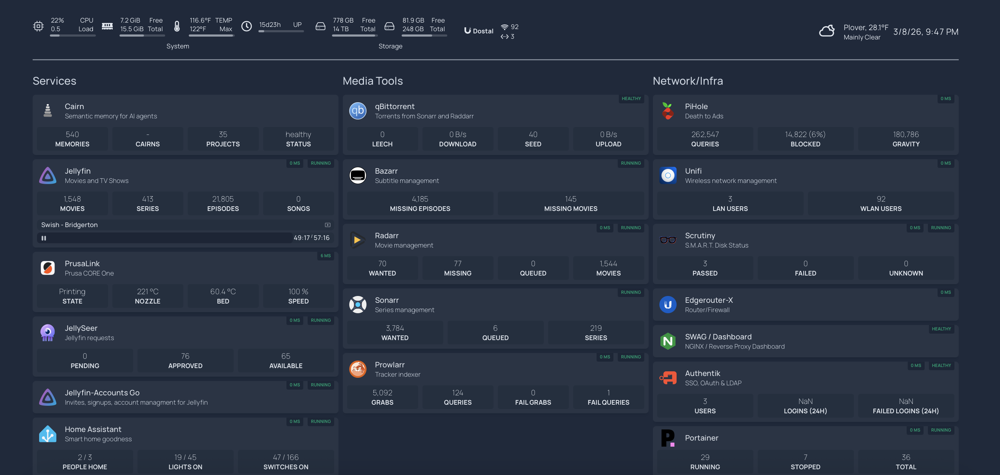

# The Hitchhiker's Guide to a Safe and Sane Full-Stack Homelab

> *Don't Panic.* But do segment your network.

A decision framework and reference implementation for running a Docker-based homelab that's secure enough to sleep at night and flexible enough to do real AI-assisted development during the day.


*The aquarium. Services, media tools, network/infra, printer status, Home Assistant — all in one pane of glass.*

## Who This Is For

You're a developer. You've maybe run a few containers locally. You're interested in self-hosting, AI tooling, or just owning your own infrastructure. You want to do it *right* — not "works until it doesn't" right, but "I understand why every piece is here and what it's protecting me from" right.

This is not a copy-paste tutorial. It's a **thinking guide** backed by working examples. You'll make decisions — this repo helps you make informed ones.

## What's In Here

### The Guide

The full-length primer, heavy on *why* and trade-offs:

| Chapter | What You'll Learn |
|---------|-------------------|
| [00 - Philosophy](guide/00-philosophy.md) | Why bother, what we optimize for, guiding principles |
| [01 - Hardware](guide/01-hardware.md) | Box separation, minimum specs, the cost argument |
| [02 - Network Segmentation](guide/02-network-segmentation.md) | VLANs, firewall rules, blast radius containment |
| [03 - Docker Foundations](guide/03-docker-foundations.md) | Compose patterns, naming, networks, volumes |
| [04 - Reverse Proxy](guide/04-reverse-proxy.md) | SWAG, Let's Encrypt, dashboard, fail2ban jails |
| [05 - Monitoring](guide/05-monitoring.md) | Healthchecks.io, dead man's switches, right-sizing |
| [06 - Backups](guide/06-backups.md) | Restic, off-prem encryption, restore drills |
| [07 - AI Dev Stack](guide/07-ai-dev-stack.md) | The cortex box, MCP servers, Postgres/pgvector, local inference |
| [08 - Security Hardening](guide/08-security-hardening.md) | Defense in depth, the layer model, what actually matters |
| [09 - Day Two Ops](guide/09-day-two-ops.md) | Updates, maintenance, incident response, growing the lab |
| [10 - Domains, Certs & Remote Access](guide/10-domains-certs-remote-access.md) | DNS, dynamic IP, TLS certs, Tailscale, VPN options |
| [11 - The Fun Stuff](guide/11-fun-stuff.md) | Ad blocking, media, home automation, and why you started this |
| [12 - AWS Free Tier](guide/12-aws-free-tier.md) | Cloud extension for your homelab — S3, Lambda, Bedrock, and more |

### The Stacks

Working `docker-compose.yml` files and `.env.example` templates, organized by function:

```
stacks/
├── core/            # Portainer, management tooling
├── swag/            # Reverse proxy, SSL, fail2ban
├── dns/             # AdGuard Home — ad blocking, split DNS
├── monitoring/      # Health checks, uptime monitoring
├── data/            # Postgres, Redis, pgvector
├── ai-cortex/       # AI dev stack — inference, MCP, embeddings
├── apps/            # Jellyfin, Vaultwarden, Homepage dashboard
├── homeassistant/   # Home automation
└── backups/         # Restic orchestration
```

### Scripts

Helper scripts for backup, restore testing, and health verification.

## Guiding Principles

1. **Safety enables speed.** The guardrails aren't here to slow you down. They're what let you experiment freely, fail fast, and recover instantly. Fear kills tinkering — a well-structured lab removes the fear.
2. **Composable primitives over platforms.** Bash, curl, YAML, cron. Simple tools that interoperate become rich. If you can't understand it, debug it, and teach it to someone else, it's too complex.
3. **Understand before you deploy.** Every container in this repo exists for a reason. The guide explains that reason.
4. **Defense in depth.** No single layer is trusted completely. Security is cumulative.
5. **Separation of concerns.** Dev workloads don't touch prod services. VLANs enforce what discipline can't.
6. **Backups are not optional.** If you haven't restored from it, it's not a backup — it's a hope.
7. **Right-size everything.** A homelab doesn't need enterprise tooling. Pick tools that earn their resource footprint.
8. **Fail loud.** Silent failures are the enemy. Monitor the monitors.

## Quick Start

There is no quick start. Read [Chapter 00](guide/00-philosophy.md) first. If that's too slow for you, this isn't the right guide — there are plenty of "deploy everything in 5 minutes" repos out there. They'll get you running. This one will keep you running.

## A Note on "Sanitized"

Every config in this repo uses placeholder values. Hostnames are `example.homelab.local`. API keys are `your-api-key-here`. Paths use `/opt/homelab/` as a base. You'll need to fill in your own values — that's the point. The `.env.example` files tell you what each variable does and what kind of value it expects.

**Never commit real secrets to a git repository.** Not even a private one. Not even "just for now."

## Resources & References

Curated starting points — not an exhaustive list, but the stuff that's actually worth your time.

### Discovery & Inspiration

- [awesome-selfhosted](https://github.com/awesome-selfhosted/awesome-selfhosted) — The canonical list of self-hostable software. Start here when you're looking for alternatives to cloud services.
- [awesome-docker](https://github.com/veggiemonk/awesome-docker) — Docker tools, tutorials, and resources. Good for finding compose examples and utilities.
- [r/selfhosted](https://www.reddit.com/r/selfhosted/) — Active community. Great for "what do you use for X?" questions. Take advice with appropriate salt.
- [r/homelab](https://www.reddit.com/r/homelab/) — Hardware-focused community. Useful for build ideas, deal alerts, and "is this overkill?" reality checks.

### Docker & Compose

- [Docker Compose documentation](https://docs.docker.com/compose/) — The official docs. Better than most tutorials.
- [LinuxServer.io](https://www.linuxserver.io/) — Maintains well-structured, consistently built container images for dozens of self-hosted apps. Their images follow a common pattern (PUID/PGID, /config volumes) that makes life easier.
- [Composerize](https://www.composerize.com/) — Converts `docker run` commands to compose YAML. Handy when a project only gives you a run command.

### Networking & Security

- [SWAG documentation](https://docs.linuxserver.io/general/swag/) — Setup guides, reverse proxy examples, fail2ban configuration.
- [fail2ban wiki](https://github.com/fail2ban/fail2ban/wiki) — For writing custom jails and filters beyond the SWAG defaults.
- [Digital Ocean community tutorials](https://www.digitalocean.com/community/tutorials) — Excellent networking and Linux fundamentals guides. Ignore the DO-specific bits, the concepts transfer.

### Backups

- [Restic documentation](https://restic.readthedocs.io/) — Clear, well-written docs. The "Preparing a new repository" and "Backing up" sections are all you need to get started.
- [Backblaze B2](https://www.backblaze.com/cloud-storage) — Cheap S3-compatible object storage. First 10GB free. Good default choice for off-prem backup targets.

### AI & Dev Tooling

- [Ollama](https://ollama.com/) — Dead-simple local LLM inference. Pull and run models like container images.
- [Open WebUI](https://github.com/open-webui/open-webui) — Chat interface for Ollama (and other backends). Solid self-hosted ChatGPT alternative.
- [pgvector](https://github.com/pgvector/pgvector) — Vector similarity search in Postgres. One extension, no new database to learn.
- [Model Context Protocol (MCP)](https://modelcontextprotocol.io/) — The protocol for giving AI tools access to context and capabilities. Understanding this is key if you're doing AI-assisted dev.

### Monitoring

- [Healthchecks.io](https://healthchecks.io/) — Cron/dead man's switch monitoring. Free tier covers homelab use. [Self-hosted option](https://github.com/healthchecks/healthchecks) available.
- [Uptime Kuma](https://github.com/louislam/uptime-kuma) — Self-hosted monitoring with a clean UI. Good complement to Healthchecks.io for HTTP/TCP checks.

### Learning & Deep Dives

- [How DNS Works (comic)](https://howdns.works/) — If you've never really understood DNS, start here. Seriously.
- [Docker networking deep dive](https://docs.docker.com/engine/network/) — Official docs on bridge, host, overlay, and macvlan networks. Read this before you get fancy.
- [SSH Hardening Guide (Mozilla)](https://infosec.mozilla.org/guidelines/openssh) — Mozilla's OpenSSH config recommendations. Copy these.
- [The Twelve-Factor App](https://12factor.net/) — Written for cloud apps, but the principles (config in env vars, stateless processes, disposable containers) apply perfectly to homelab architecture.

## License

MIT. Use it, fork it, teach from it.

## Contributing

Open an issue or PR. If you've solved a problem that would help others, share it. If you disagree with a trade-off, let's discuss it — that's how we all get better.
